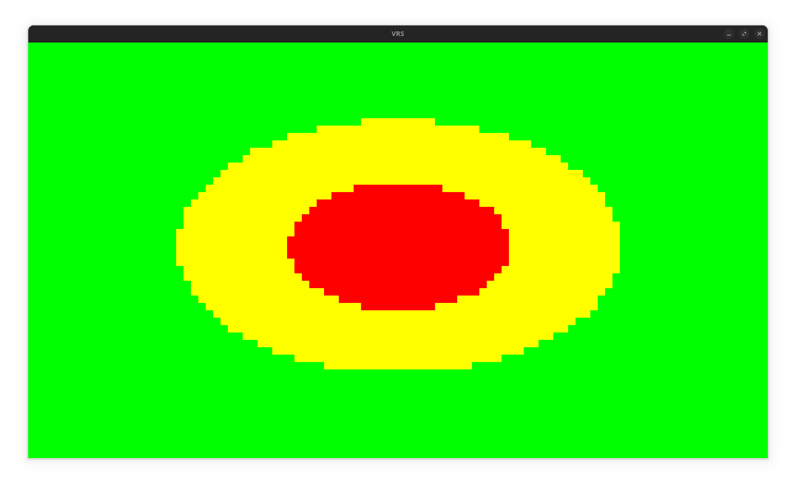
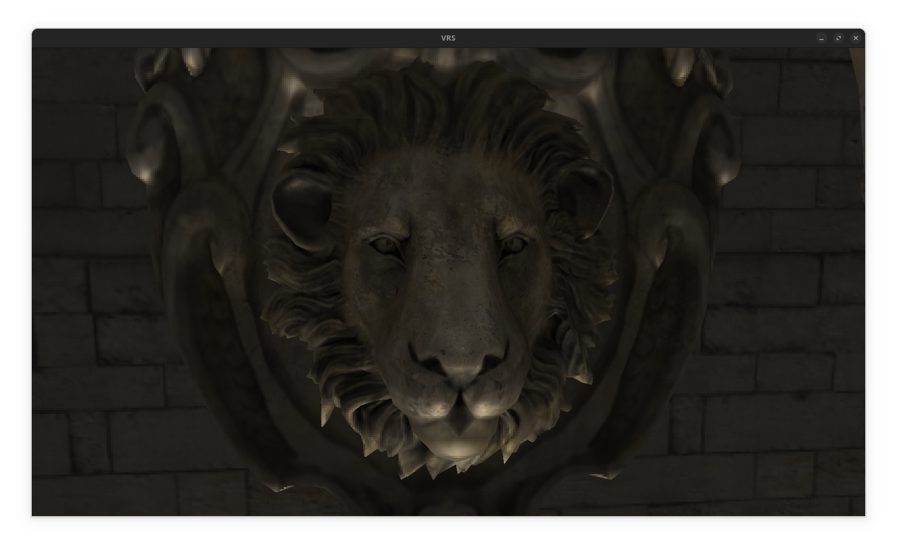
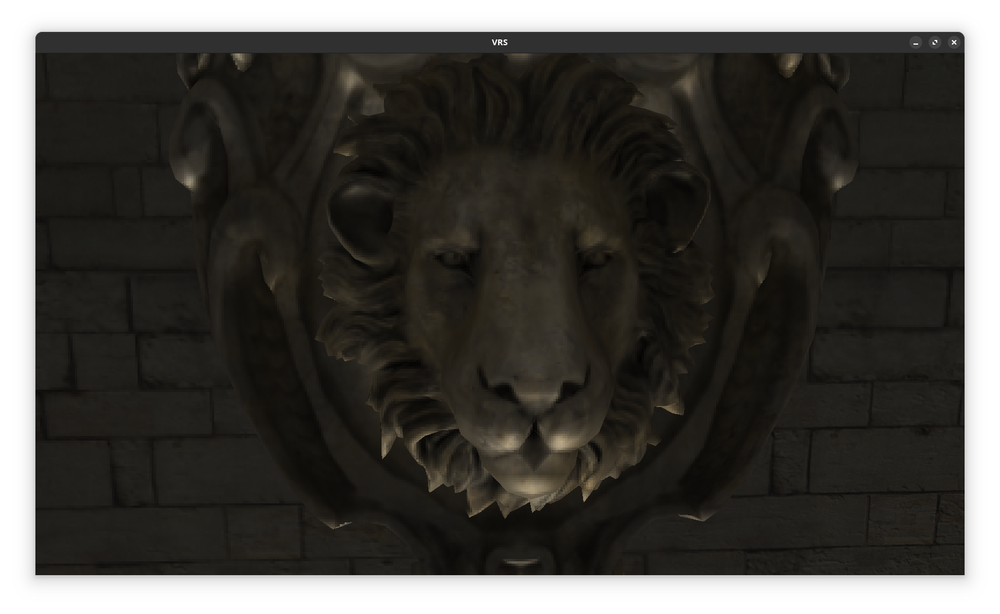
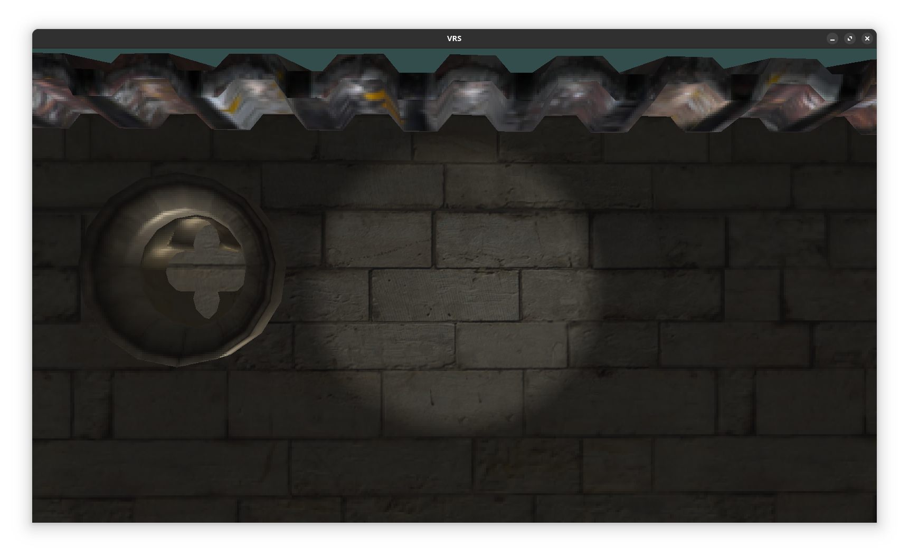
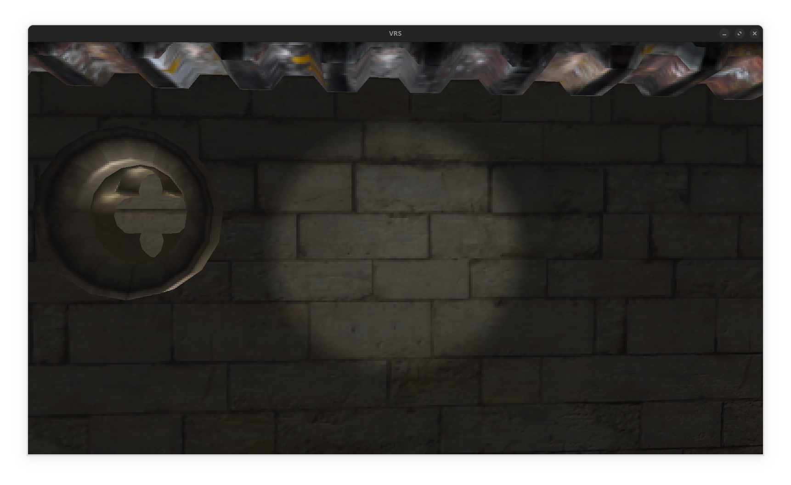

# VRS
Exploring VRS OpenGL `GL_SHADING_RATE_IMAGE_NV` extension to enable foveated rendering.

---

## Demo

https://github.com/user-attachments/assets/660baaab-4bcf-4b3f-915c-be4ae9647da1

### How it works

Variable Rate Shading (VRS) is enabled and controlled by a shading rate image.

- Red: 1 invocation per pixel
- Yellow: 1 invocation per 2x2 pixels
- Green: 1 invocation per 4x4 pixels

This mimics the way the human eye perceives detail—maximum acuity in the foveal center and lower detail in peripheral regions.

### Comparison

Focus on the center of the image             |  Focus on the border
:-------------------------:|:-------------------------:
  |  
  |  
